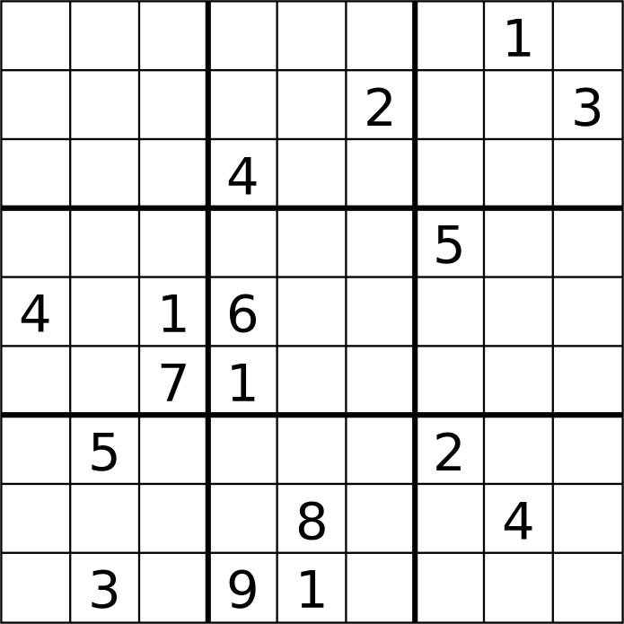

# Solver Sudoku

This is my first ever programm made during free time. I also made other related stuff around the general idear of solving the game of Sudoku.

## Rules

[Sudoku](https://en.wikipedia.org/wiki/Sudoku) is a logic puzzle. The objective is to fill a 9 × 9 grid with digits so that each column, each row, and each of the nine 3 × 3 subgrids that compose the grid (also called "boxes", "blocks", or "regions") contain all of the digits from 1 to 9. The puzzle setter provides a partially completed grid, which for a well-posed puzzle has a single solution.

## Import

You can import any Sudoku grid you find online using the script [capture](capture.py)
When you run it, a window apear with a canevas and a few option:

- Capture: replace the canvas by a picture of your current screen

- Click on the canevas: select a rectangle of intrest

- Resize: crop the canevas to the selected rectangle

- Compute Matrix: when the canevas or the selected rectangle correspond to a Sudoku grid, read the digits in each cell and show them upward. It is not a perfect prossess, please verify and correct before saving

- Save: save the Sudoku matrix computed as a numpy array of int, in the folder savedSudoku. The missing cell are labeled 0.

## Original Solver

[My first algorithm solve Sudoku](sudoku.py) is a bit crapy but I'm still proud and nostalgic about it. It thinks like a human and apply mostly the sames strategies as any medium player (hidden, naked pairs, triples and quads, reduction and pointing

It is slow and can take to 15 min to converge. I don't know if it can solve every grid cause I only tried a few but it worked.

## New Solver: a probabilist one

When a Sudoku isn't yet complited, as in the exemple picture, what is the probability of getting a 3 in the first cell (top-left) ?

- If you look at the first line, 3 seems to be possible in 5 cells (1, 3, 4, 5, 6). So a 1/5 chance ?
- If you look at the first collumn, 3 seems to be possible in 3 cells (1, 3, 4, 6). So a 1/3 chance ?
- If you look at the first house (box of 3x3), 3 seems to be possible in 4 cells (1, 3, 7, 9). So a 1/4 chance ?
- If you look at the first cell, 7 digits seems possible (2, 3, 5, 6, 7, 8, 9). So a 1/7 chance ?
- If you cheat and solve the Sudoku before answering the question you know it's not a 3 it's a 7. So the probability is 0 ? But we can know that so we ignore it for now.

I propose to initial every propability in an not given cell to 1/9 as there is 9 digits possibles. In a given cell, the probability is initalise at 0 or 1 directly.

By an iterative process, we look alternatively at the lines, the collumns, the houses and the digits in the cell. We normalize each group of probabilities by dividing them per there sum.

This iterative prossess seams to converge to not only a realistic probability distribution but even the solved distribution. In other word, it's a solving algorithm.

It's not only fast, it's new, easy, aestetic and maybe with a polinomial complexity (lol).

We can fasten the prossess by doing a softmax every once in the while but at the risk of failing if done too soon or too often.

You can test this probabilist solver in the file [newSudoku](newSudoku.py)
